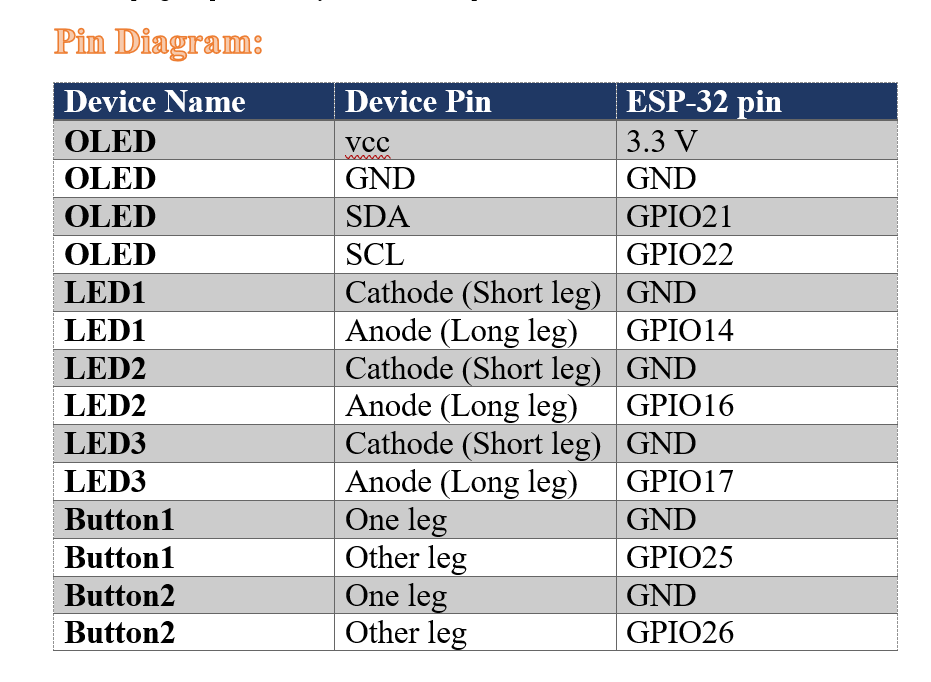
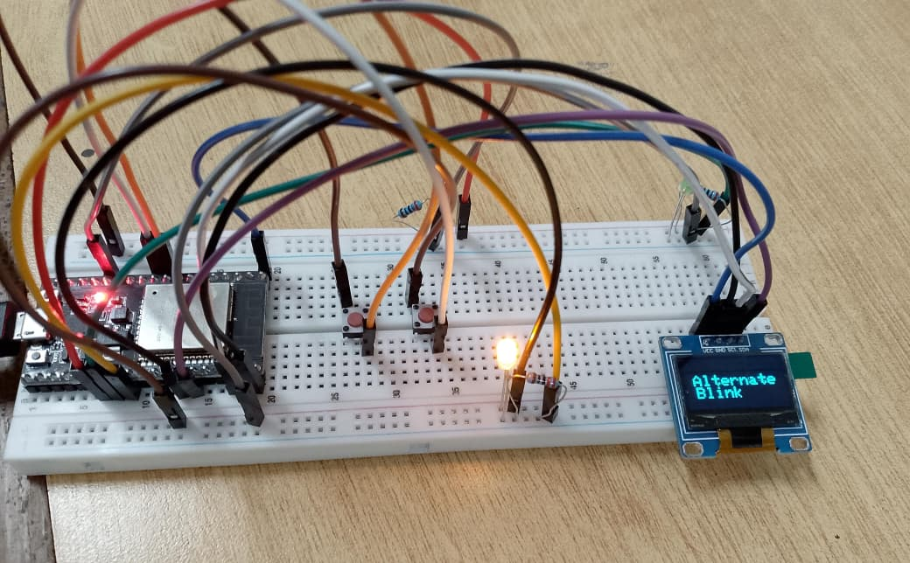
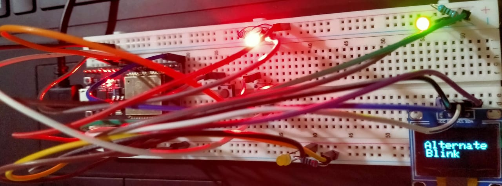
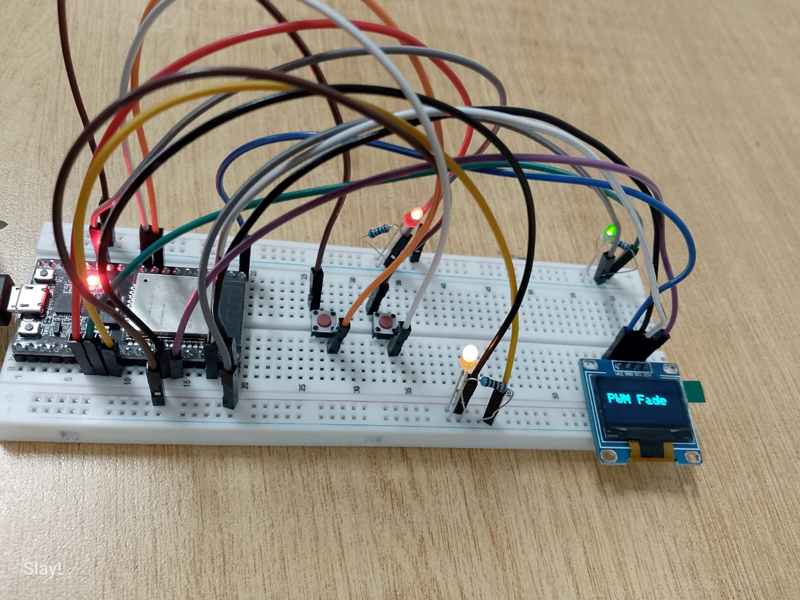
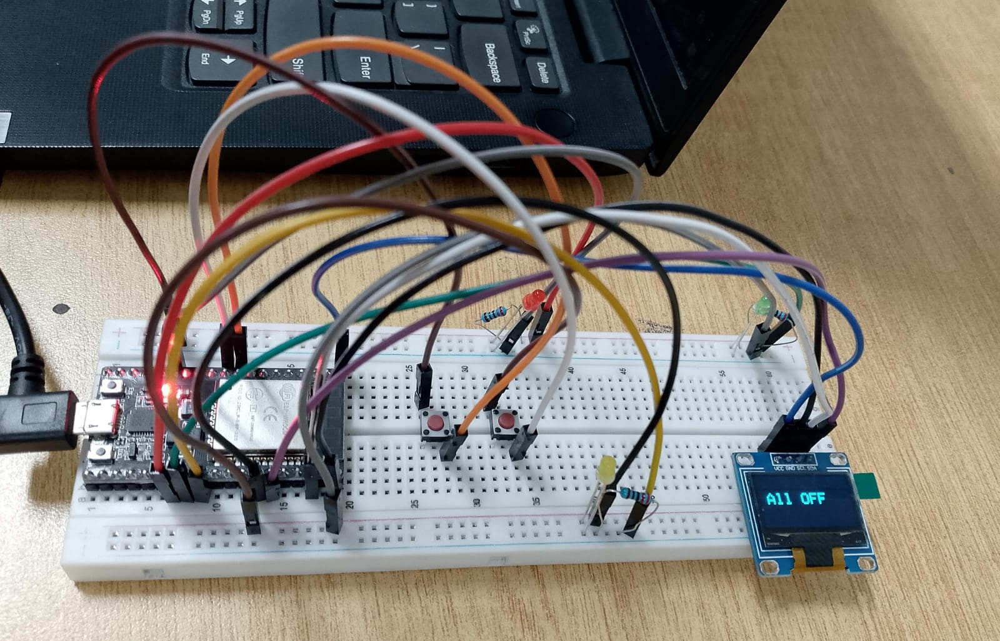
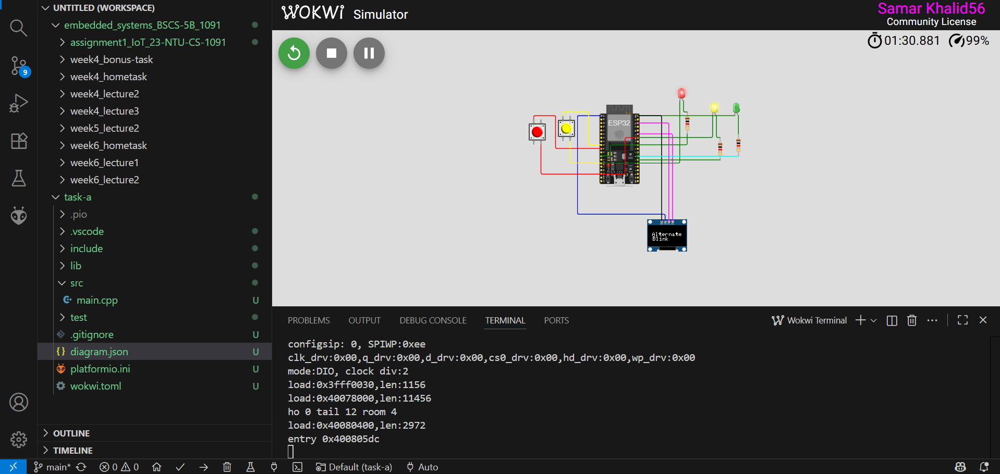
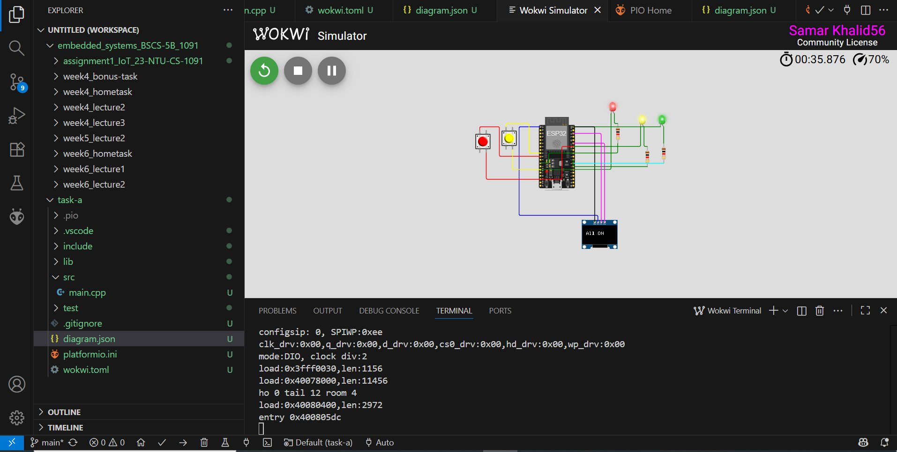
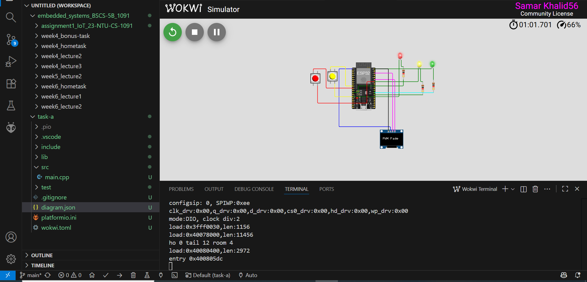

<h1>Pin Map For Circuit Diagram</h1>
</img>
 

<h1>Kit Output ScreenShots</h1>
</img>
 
</img>
 
</img>
 
</img>
 
</img>

 

<h1>Wokwi Output Pictures</h1>
</img>
 
</img>
 
</img>
 
</img>

 
<h1>Wokwi Project Link</h1>
<a href="https://wokwi.com/projects/445509046222119937">Visit Wokwi Project</a>
 